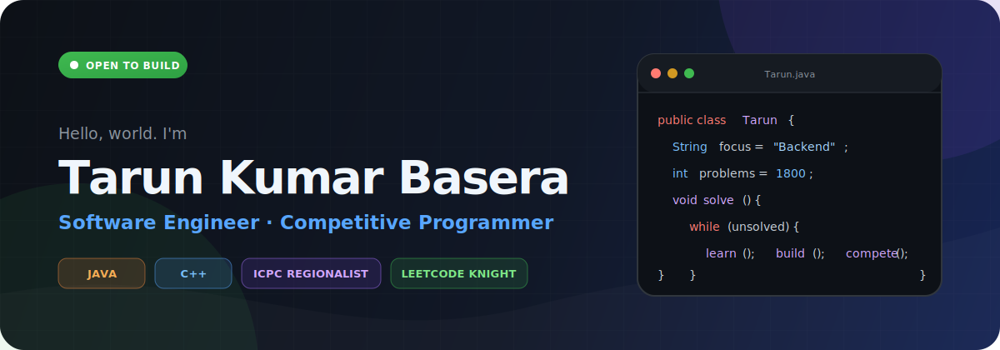

<p align="center">
  
</p>

<p align="center">
  <a href="https://www.linkedin.com/in/tarun-kumar-basera-34a77024b/"></a>
  <a href="https://leetcode.com/u/tarunkumarbasera/"></a>
  <a href="https://icpc.global/ICPCID/1L44GX5WM1S6"></a>
</p>

## `$ whoami`

I'm **Tarun Kumar Basera**, a backend-focused software engineer and competitive programmer from Pune, India.

- Building backend services and automation as an **SDE Intern at Oracle**
- Pursuing a B.E. at the **Army Institute of Technology, Pune**
- Writing production code primarily in **Java** and solving algorithmic problems in **C++**
- Interested in backend engineering, distributed systems, developer tooling, and clean APIs
- I enjoy turning difficult problems into simple, efficient solutions

## Competitive programming

<table>
  <tr>
    <td align="center"><strong>85</strong><br /><sub>ICPC Asia Chennai<br />Regional Rank</sub></td>
    <td align="center"><strong>1913</strong><br /><sub>LeetCode<br />Knight</sub></td>
    <td align="center"><strong>1800+</strong><br /><sub>DSA Problems<br />Solved</sub></td>
  </tr>
</table>

## Engineering toolbox

<p>
  
  
  
  
  
  
  
  
  
  
</p>

## Featured builds

<table>
  <tr>
    <td width="50%" valign="top">
      <h3><a href="https://github.com/enlighttarunkumar/Real_time_chat_apk">DoubtFun</a></h3>
      <p>A focused academic chat platform with professor discovery, real-time WebSocket rooms, secure professor access, pinned answers, ratings, and trie-backed prefix search.</p>
      <p><code>Java</code> <code>Spring Boot</code> <code>MongoDB</code> <code>WebSocket</code> <code>React</code></p>
    </td>
    <td width="50%" valign="top">
      <h3><a href="https://github.com/enlighttarunkumar/MyRedis">MiniRedi</a></h3>
      <p>An LRU cache built around a hash map and doubly linked list, providing constant-time lookup, update, and eviction operations.</p>
      <p><code>C++</code> <code>Java</code> <code>Data Structures</code> <code>O(1)</code></p>
    </td>
  </tr>
</table>

## Current focus

```text
Backend engineering  ███████████████████░  Java · Spring · REST · WebSocket
Problem solving      ████████████████████  DSA · C++ · Competitive Programming
Developer tooling    ████████████████░░░░  Playwright · Docker · CI/CD
```

<p align="center">
  <em>Learn deeply. Build clearly. Compete relentlessly.</em>
</p>
